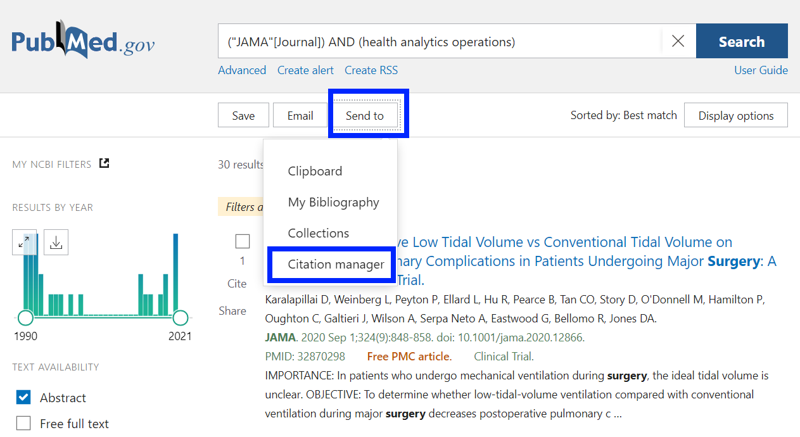

### Exporting from PubMed

1. Go to PubMed and do a search. We recommend using the advanced search feature to keep the number of hits reasonable (e.g., by filtering for a subset of journals). 

    

2. Ensure that the "Abstracts" box is checked on the left hand side. 

    

3. Export the results to .nbib and download to your PC
    
    

    
4. Use the upload link on this tab and navigate to the file
    

5. Click Run Topic Model. The app will navigate to the "Topic Model" tab and display the results, with the new articles included!

